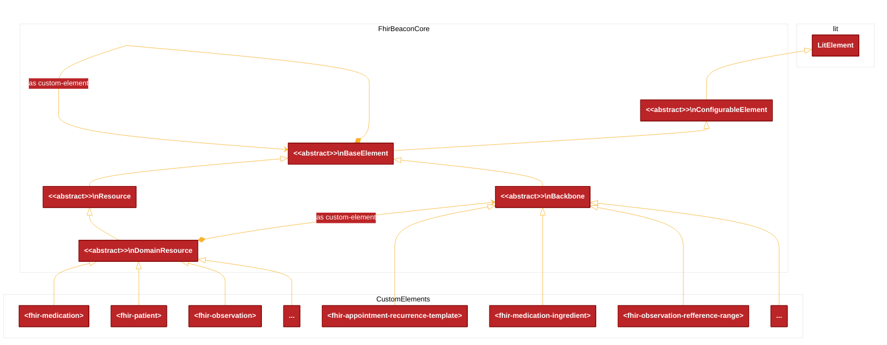

# FHIR Beacon 

A FHIR data library for the frontend.

* library docs: [library](./packages/library/README.md).
* storybook: https://fhir-beacon.deno.dev
* showcase: https://fhir-beacon-app.deno.dev
* for details about the project read the [background](./packages/library/docs/background.md)
    
## Usage example:
```typescript

import {DisplayConfig, ObservationData, PatientData} from 'fhir-beacon'
import {html} from 'lit'

type FhirRendererProps = {
  data: { patient: PatientData; observation: ObservationData; }
  config: DisplayConfig
};

export const FhirRenderer= ({ data, config }:FhirRendererProps) => {
  return html`
    <div>
      <fhir-patient .data=${data.patient} ?summaryonly=${config.summaryonly} ></fhir-patient>
      <hr/>
      <fhir-observation .data=${data.observation} ?showerror=${config.showerror} ></fhir-observation>
    </div>
  `
}


```
## The Core Model



## Packages

### [`library`](./packages/library/README.md)
The library provides a collection of web components for working with FHIR data in the browser.
- [storybook catalog app](https://fhir-beacon.deno.dev)
- [read more docs](./packages/library/README.md)
- [the model](./packages/library/docs/model.md)
### [`app`](./packages/app/README.md)
A showcase application for demonstrating the integration use-cases.
- [use-case showcase app](https://fhir-beacon-app.deno.dev)
- [read more](./packages/app/README.md)

### `data`
Development and testing time data. It mostly contains FHIR reference data.

### `server`
Development and testing time configuration for running HAPI FHIR server in docker.
