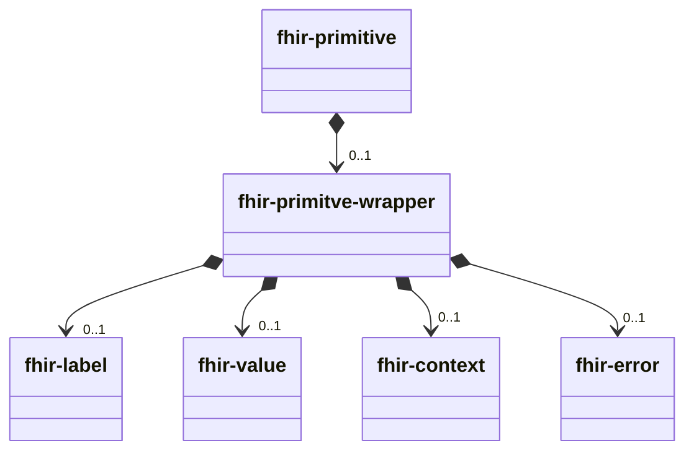
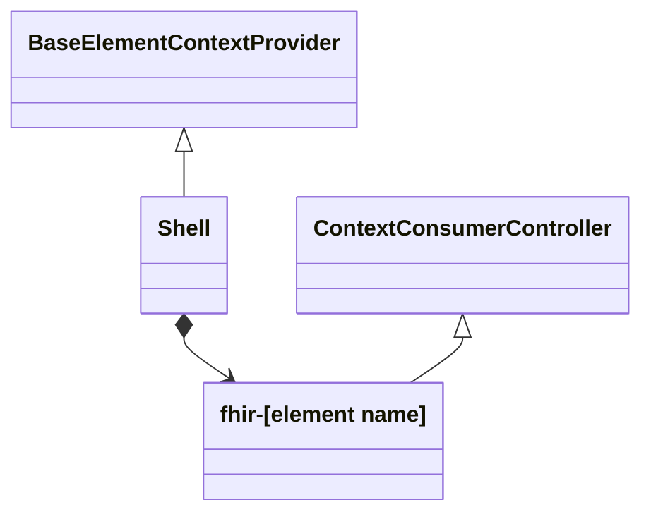
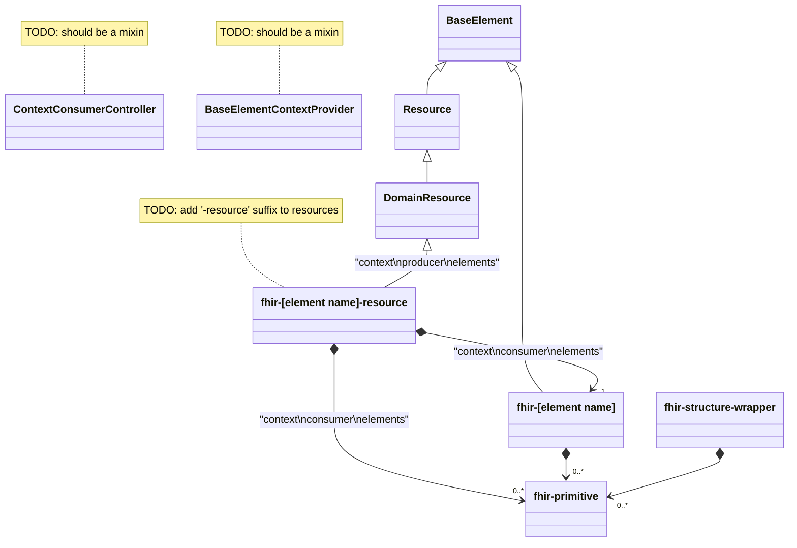

## fhir simple/core property

### template

```html

<fhir-primitve >
    <fhir-primitive-wrapper >
        <fhir-label ></fhir-label >
        <fhir-value ></fhir-value >
        <fhir-context ></fhir-context >
        <fhir-error ></fhir-error >
    </fhir-primitive-wrapper >
</fhir-primitve >
```

### object model



## List of properties

### template

```html

<fhir-wrapper>
    <fhir-primitive ></fhir-primitive >
    <fhir-primitive ></fhir-primitive >
    <fhir-primitive ></fhir-primitive >
</fhir-wrapper>

```

### object model



## FHIR element model

### object model


