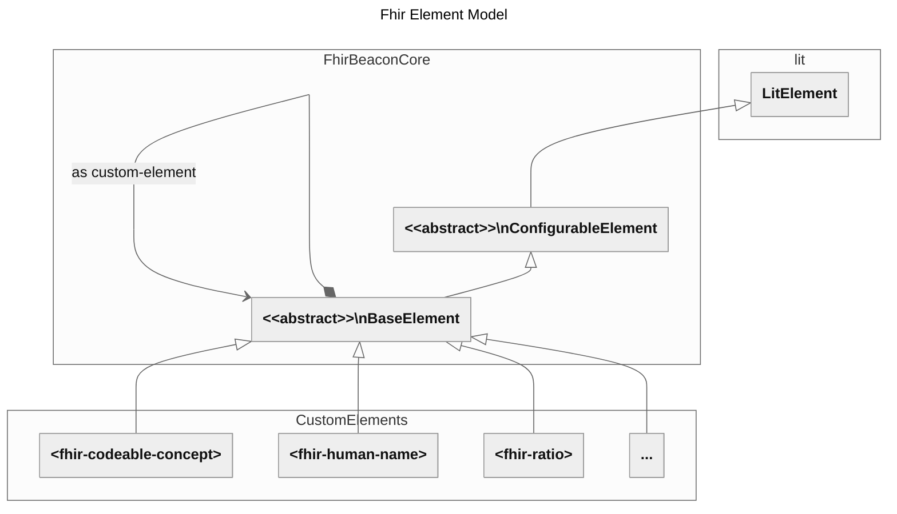
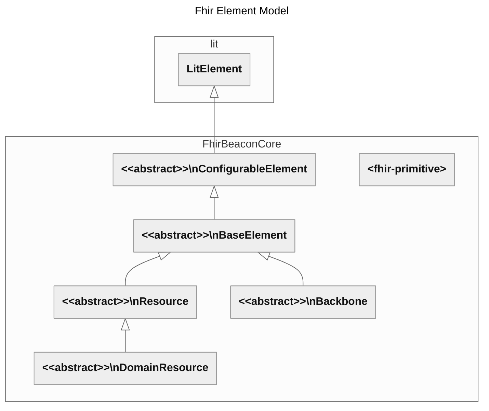
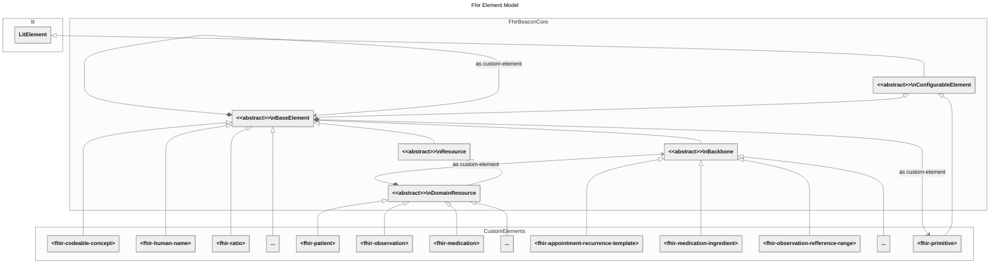

# The Component Model

## FHIR element model

### as a template

```html

<fhir-medication></fhir-medication>

```    

### object model






 ```mermaid
---
title: Fhir Element Model
config:
  theme: neutral
  class:
    hideEmptyMembersBox: true
---
classDiagram
    direction BT

    namespace lit {
        class LitElement:::dep
    }

    namespace Base {
        class ConfigurableElement["&lt;&lt;abstract&gt;&gt;\nConfigurableElement"]:::base
        class DataElement["&lt;&lt;abstract&gt;&gt;\nDataElement"]:::base
        class PresentableElement["&lt;&lt;abstract&gt;&gt;\nPresentableElement"]:::base
    }

    namespace FhirBeaconCore {
        class BaseElement["&lt;&lt;abstract&gt;&gt;\nBaseElement"]:::base

        class Primitive["&lt;fhir-primitive&gt;"]:::prim
    }

    namespace FhirModelImplementation {
        class FhirModelImpl["&lt;fhir-*&gt;"]:::base
    }

    ConfigurableElement --|> LitElement
    DataElement --|> ConfigurableElement
    PresentableElement --|> DataElement
    BaseElement --|> PresentableElement
    Primitive --|> ConfigurableElement
    FhirModelImpl --|> BaseElement
    FhirModelImpl *--> FhirModelImpl
    FhirModelImpl *--> Primitive


```



## FHIR Primitives

### as a template

```html

<fhir-primitve>
    <fhir-primitive-wrapper>
        <fhir-label></fhir-label>
        <fhir-value></fhir-value>
        <fhir-context></fhir-context>
        <fhir-error></fhir-error>
    </fhir-primitive-wrapper>
</fhir-primitve>
```

### as and object model


## Listing properties

### as a template

```html

<fhir-wrapper>
    <fhir-primitive></fhir-primitive>
    <fhir-primitive></fhir-primitive>
    <fhir-primitive></fhir-primitive>
</fhir-wrapper>

```

### as an object model

NOTE: missing diagram
