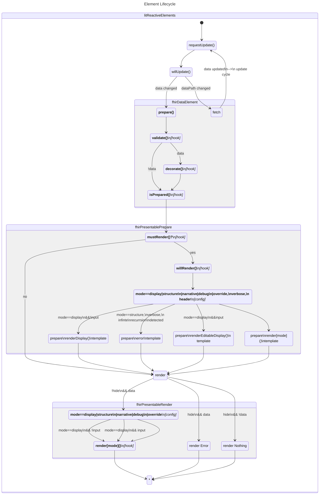
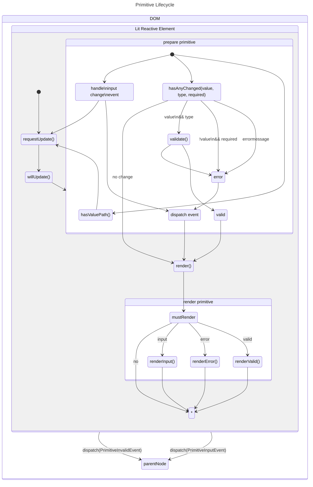

# FHIR Element Lifecycle

## FHIR Base Element

All complex types, resources, and domain resources implement [BaseElement](src/internal/BaseElement.ts) .
BaseElement is a public extension point that contains two sub-lifecycles: data lifecycle and presentation lifecycle.

The implementation provides 'hooks' where it is considered valid to extend or override the implementation.

## FHIR Primitive

The FHIR [Primitive](src/components/primitive/primitive.ts) is the base key-value and key-input component in the
library. It is responsible to render label, value, error, and context on the screen.

